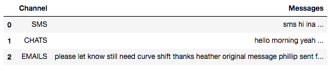
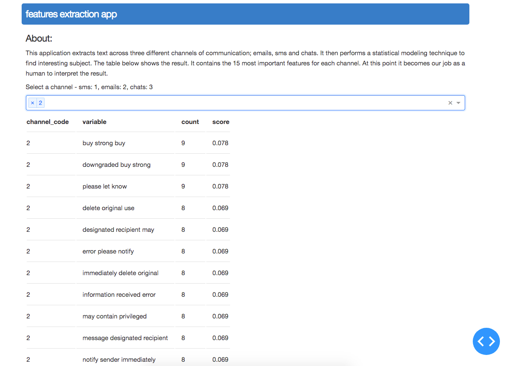

# Features Calculations App 

This project is intended to be a walkthrough on the development of a tool (web application) that gathers data from several channel of communications and counts the value of a chosen feature of interest across the different channels. This is achieved with a statistical modeling technique that is able to convert text to numeric vectors in order to determines how important a word or a combination of words are by looking at how frequently they appear in a document.
For this exercise, I was given 3 choices of features to study: Stress, Closeness and Collusion Behaviour. I decided to go with Collusion Behaviour. Please take the time to go through the notebooks as it contains in more details the explaination of my approach and the techniques used to extract information from the communication samples provided.


## Workflow


#### 	1. Dataset Collection:
Created 3 points of entry for the data injection and used the web scraping tool Beautiful Soup to scrape the body of messages for each channel of communication. 
To make it simple and save time on my preprocessing stage, I only considered collecting data from 3 folders inside the communication samples directory; the chats folder, the sms folder and the inbox subdirectory located inside the emails. The reason was, these 3 folders have different file format and I understand that one of the goal of this test task is to assess my ability to collect data from different source and file format. So I made sure to collect data from those 3 folders. 



The emails folder has more files than the sms, chats, bbg and papota all combined together. There is a huge imbalance in term of potential of information to retrieve across items.

#### 	2. Preprocessing and Exploratory Data Analysis: 
The preprocessing and cleaning stage was straight forward. I applied some text cleaning techniques such as removing punctuation, multilanguage stop words removal, convert some characters to lowcase etc. The challenge encoutered on this stage was when removing the chinese and hindu characters as they are not supported by the nltk librairies. 

For the exploratory analysis, I took a look at the most common words and then created a words cloud for each channel. The findings was quite deceiving. It is usually more interesting to perform some more analysis once the features are exposed.


#### 	3. Feature Engineering - TF-IDF Vectorizer: 

Used the bag of words analysis approach to tokenise the data and create trigrams.
Why TFIDF vectorizer? I have noticed lot of repeated words in the emails folder for instance words like Hi, Thanks and How are you are very frequent. The goal is to scale down the impact of tokens that occur very frequently in our corpus because they  affects negatively our analysis. The tf-idf algorihtm is very efficient in reducing noise. 

#### 	4. App Creation:
Created the web app using the framework [Dash](https://plotly.com/dash/). 




## Repo content 

	├── README.md
	│  
	├── data
	│   ├── immutable_input_data.mbox
	│   ├── raw.json
	│   ├── raw_corpus.json
	│   ├── raw_data.json
	│   └── term_matrix.json
	│  
	├── models
	│   └── tfidf.pickles
	│  
	├── notebooks
	│   ├── 1.0-mtf-text_cleaning.ipynb
	│   ├── 1.1-mtf-initial-exploratory_analysis.ipynb
	│   ├── 1.2-mtf-features_engineering.ipynb
	│   ├── Pickles
	│   │   ├── clean_corpus.pickle
	│   │   ├── df.pickle
	│   │   ├── raw_corpus.pickle
	│   │   └── term_matrix.pickle
	│   └── lda_model.log
	│  
	│  
	├── screenshot_webApp.png
	│  
	├── src
	│   ├──__PATH_FILES__.py
	│   ├──__init__.py
	│   ├── app.py
	│   ├── assets
	│   │   └── sytlesheet.css
	│   ├── data_cleaning.py
	│   ├── data_loading.py
	│   ├── data_processing.py
	│   ├── features_extraction.py
	│   ├── requirements.txt


*	 data - Serialized data.

*	 models - Saved tf-ifdf parameters.

*	 notebooks - The Ipyhton notebooks for exploratory analysis and algorithms designing process.

*	 src - The excutable codes including the requirements.txt file.
		
		
		
		


## Prerequisites

Make sure to have [pip](https://pip.pypa.io/en/stable/) and [Python3+](https://www.python.org/downloads/) installed in your local machine. 


## Set up and Run it

From the comnand line Linux and macOs:

1. Clone repo  ``` $ git clone https://bitbucket.org/mtfaye/behavox_assignment.git ```

2. Change directory ``` $ cd ../behavox_assignment/src/ ```
	  
3. Open file ``` __PATH_FILES__.py ```  and replace accordingly the absolute paths to connect the app with the data. 

4. Create a virtual environment venv, activate it and install the necessary dependencies.
		
	     $ python3 -m venv venv
		
	     $ source venv/bin/activate
		
	     $ pip install -r requirements.txt
	     
5. Run the app now.
		
	     $ python3 app.py


## Who do I talk to? ###

* @author: Mouhameth T. Faye - tahafaye@hotmail.com
